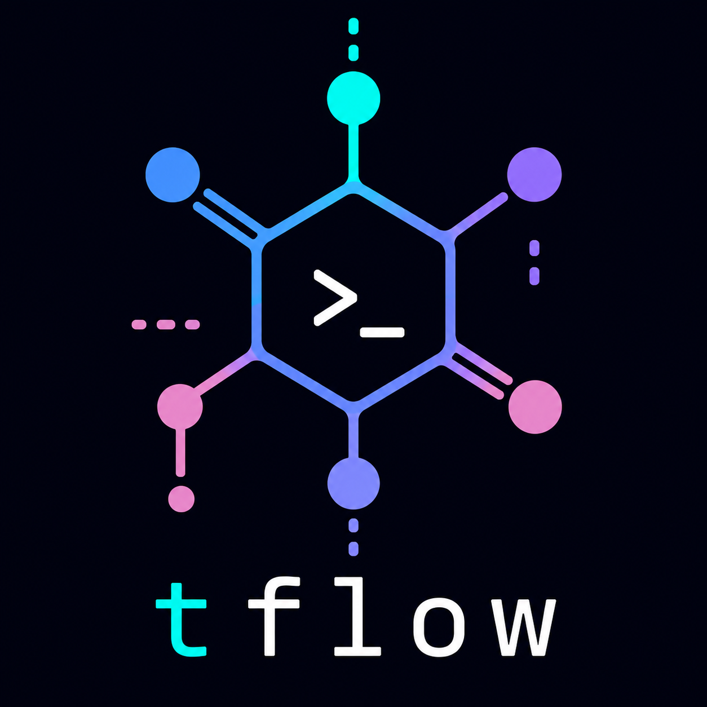

<p align="center">
  
</p>

<p align="center">
  A focused terminal session manager built on top of tmux.
</p>

<p align="center">
  
  
  
</p>

---

`tflow` is a small terminal workflow helper.

It gives every terminal its own session environment, while still allowing important sessions to become persistent project sessions.

The goal is simple: fewer terminal windows, cleaner context switching, and a fast keyboard-first workflow.

## Features

- tmux-backed terminal sessions
- fresh volatile session on every start
- map a group of terminals aka sessions to a project
- minimal sidebar to handle sessions and projects

## Ideas

- session types
  - agent: start an agent inside a project
  - nvim: start nvim inside a project (with a terminal that can be toggled)

## Concept

`tflow` starts like a normal terminal.

The only visible UI is a small top badge showing the current project and session. Press `Ctrl+F` to open the sidebar.

Scrolling the mouse wheel pages back through a session's history like a normal terminal's scrollback. Plain clicks and drags are left untouched, so native terminal text selection keeps working as before.

Volatile sessions are temporary.  
Persistent sessions belong to a project and survive terminal exit.

## Keybindings

| Key | Action |
|---|---|
| `Ctrl+F` | Toggle sidebar |
| `Ctrl+Q` | Quit current tflow instance |
| `Ctrl+C` | Close sidebar, or pass through when sidebar is closed |
| `Esc` | Cancel current prompt or close sidebar |
| `?` | Toggle help |
| `j` / `k` | Move selection |
| `Enter` | Switch to selected session |
| `n` | Create session |
| `N` | Create project |
| `p` | Switch project |
| `e` | Edit project workdir |
| `r` | Rename session |
| `R` | Rename project |
| `m` | Move session to another project |
| `d` | Delete session |
| `D` | Delete project |

## Install

```sh
go install github.com/rapsnx/tflow/cmd/tflow@latest
```

## Run

```sh
tflow
```

Or directly inside a terminal emulator:

```sh
alacritty -e tflow
```

## Project Status

`tflow` is experimental and under active development.

The current focus is a small, reliable foundation:

- clean tmux backend
- minimal persistent store
- predictable project/session lifecycle
- fast keyboard-first sidebar UI

## Design

`tflow` uses a dark terminal-first design inspired by the Catppuccin color palette.

It should feel like a small terminal tool, not a full IDE.
