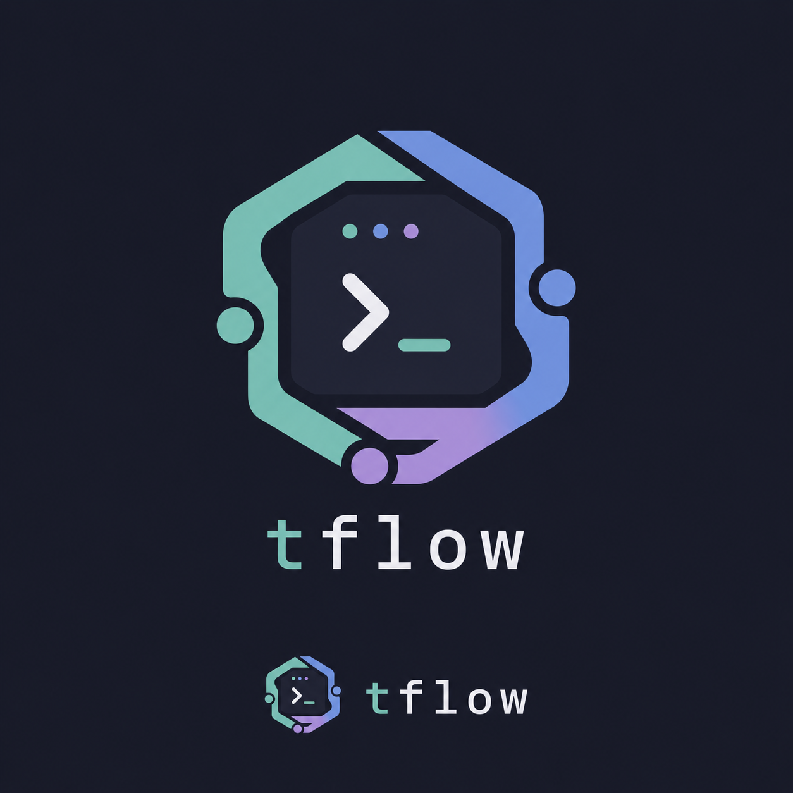

<p align="center">
  
</p>

# tflow

`tflow` is a focused tmux-backed session manager for project-scoped terminal and agent sessions.

It keeps sessions grouped by project, starts with a bootstrap project and `code` session on first run, and opens a sidebar with `Ctrl+F` for project and session actions.

## Behavior

- startup creates a random project and a `code` session on first run
- each logical session maps to an internal tmux session name like `garden_code`
- the UI only shows the logical session name, not the internal tmux name
- the sidebar shows sessions for the current project only
- projects and sessions are persisted in `state.json`
- project config is stored as YAML in the configured projects directory
- `Ctrl+F` toggles the sidebar pane in the current tmux window

## Keys

- `j` / `k`: move through sessions in the current project
- `Enter`: switch to the selected session
- `t`: create a new terminal session in the current project
- `a`: create a new agent session in the current project
- `r`: rename the selected session
- `R`: rename the current project
- `P`: open the project overlay
- `n` in the project overlay: create a new project
- `m`: move the selected session to another project using hints
- `Ctrl+Q`: terminate the current project after confirmation
- `Esc`, `Ctrl+C`: close the sidebar

## Project Config

Project configs are stored as YAML in the configured projects directory.

```yaml
name: "small"
workdir: "/tmp/project-small"
agent-cmd: "codex"
```

Additional legacy fields such as `agent-binary`, `protect`, and `cluster` are still parsed, but the current sidebar workflow is centered on terminal and agent sessions.

## App Config

`config.yaml` lives beside `state.json` in the tflow config directory.

```yaml
projects-dir: "~/.config/tflow/projects"
theme: "catppuccin"
colors:
  blue: "#89b4fa"
```

Built-in themes:

- `catppuccin` (default)
- `forest`

## Run

```sh
go run ./cmd/tflow
```

Open the sidebar directly with:

```sh
go run ./cmd/tflow menu
```

## Nix

Build the package with:

```sh
nix build .#tflow
```

The flake also exports a Home Manager module.
